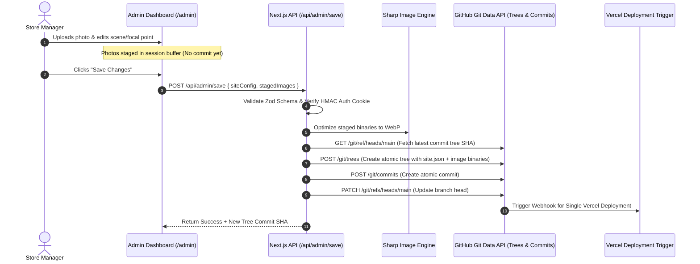

# TOM Women's Fashion Website & Git-Based CMS — Final Production Implementation Plan

Build a production-grade, editorial women's fashion web application for **TOM (توم للملابس)** using **Next.js (App Router)**, **TypeScript**, and **Tailwind CSS**. Features true viewport-accurate focal point positioning, an atomic single-commit GitHub tree pipeline, pure typographical public RTL interface, and complete end-to-end integration testing.

---

## Refined Core Requirements

> [!IMPORTANT]
> **Production Architecture & Verification Directives**
> 1. **True Viewport-Accurate Focal Point Previews**:
>    - Focal Point Editor provides exact resolution presets:
>      - **Desktop**: `1440 × 900`, `1920 × 1080`
>      - **Mobile**: `360 × 800`, `390 × 844`, `430 × 932`
>    - The preview container dynamically calculates the exact aspect ratio of the active viewport preset and selected scene type (`Full Screen`, `Full Width`, `Split 50/50`, `Split 60/40`, `Asymmetric 65/35`), guaranteeing true WYSIWYG crop accuracy.
> 2. **One Atomic GitHub Save Commit (Git Trees API)**:
>    - Pending uploads are staged locally/session-buffered.
>    - Clicking "Save Changes" creates **ONE ATOMIC COMMIT** on GitHub via `POST /git/trees` and `POST /git/commits` containing both optimized media files (`public/uploads/`) and `content/site.json`.
>    - Triggers exactly **ONE Vercel deployment** per CMS save operation.
> 3. **End-to-End Runtime Integration Verification**:
>    - Perform empirical testing across auth security, session cookies, Sharp WebP pipeline, Atomic GitHub tree commits, SHA conflict protection, branch status toggles, phone/WhatsApp links, Google Maps fallback, and responsive viewports (`1440x900` to `360x800`).

---

## Technical Pipeline

---

## Proposed Changes

### Core API & GitHub Git Trees Integration

#### [MODIFY] [`lib/github.ts`](file:///d:/work/websites/TOM website/lib/github.ts)
Implement `createAtomicGitHubCommit` using GitHub Git Data Trees API:
1. `GET /repos/{owner}/{repo}/git/refs/heads/{branch}` -> Get head commit SHA.
2. `GET /repos/{owner}/{repo}/git/commits/{sha}` -> Get base tree SHA.
3. `POST /repos/{owner}/{repo}/git/blobs` -> Post image binaries & `site.json` content as git blobs.
4. `POST /repos/{owner}/{repo}/git/trees` -> Construct new atomic tree with blob SHAs.
5. `POST /repos/{owner}/{repo}/git/commits` -> Create single commit.
6. `PATCH /repos/{owner}/{repo}/git/refs/heads/{branch}` -> Update branch reference.

#### [MODIFY] [`app/api/admin/save/route.ts`](file:///d:/work/websites/TOM website/app/api/admin/save/route.ts)
Accept `siteConfig` and array of `stagedImages`, run Sharp optimization server-side, invoke `createAtomicGitHubCommit`, and return result.

#### [MODIFY] [`app/api/admin/upload/route.ts`](file:///d:/work/websites/TOM website/app/api/admin/upload/route.ts)
Receive upload, run Sharp WebP optimization, save file to temporary/uploads directory with WebP base64 preview, and return staged media metadata (no GitHub commit until Save).

---

### Viewport-Accurate Focal Point Editor & Admin UI

#### [MODIFY] [`components/admin/FocalPointEditor.tsx`](file:///d:/work/websites/TOM website/components/admin/FocalPointEditor.tsx)
Add interactive Viewport Preset Selector:
- **Desktop**: `1440 × 900` (16:10), `1920 × 1080` (16:9)
- **Mobile**: `360 × 800` (9:20), `390 × 844` (9:19.5), `430 × 932` (9:19.5)
Dynamically scale crop preview containers using exact viewport preset aspect ratios for `Full Screen`, `Full Width`, `Split 50/50`, `Split 60/40`, and `Asymmetric 65/35`.

#### [MODIFY] [`components/admin/AdminDashboardClient.tsx`](file:///d:/work/websites/TOM website/components/admin/AdminDashboardClient.tsx)
Integrate staging queue for uploads, atomic save trigger, scene viewport focal point modal, and branch/contact management.

---

## Verification Plan

### Integration & Runtime Test Suite
1. **Authentication & Security**:
   - Verify login with correct password sets HttpOnly cookie.
   - Verify invalid password returns 401.
   - Verify `/api/admin/save` rejects unauthenticated requests with 401.
   - Verify `GITHUB_TOKEN` is strictly server-side.
2. **Atomic GitHub Tree Save**:
   - Stage 2 images + update store text -> Click Save -> Verify exactly 1 atomic commit is created on GitHub.
3. **Focal Point Viewport Accuracy**:
   - Switch presets (`1440x900`, `1920x1080`, `360x800`, `390x844`, `430x932`) and verify preview container proportions update to match actual viewport.
4. **Interactive Store & Contact Operations**:
   - Test Misurata phone link (`tel:0913335999`), WhatsApp E.164 link, Google Maps link, and fallback embed.
   - Test Tripoli Coming Soon status toggle.
5. **Build Verification**:
   - Run `npm run build` and ensure clean zero-error build.
